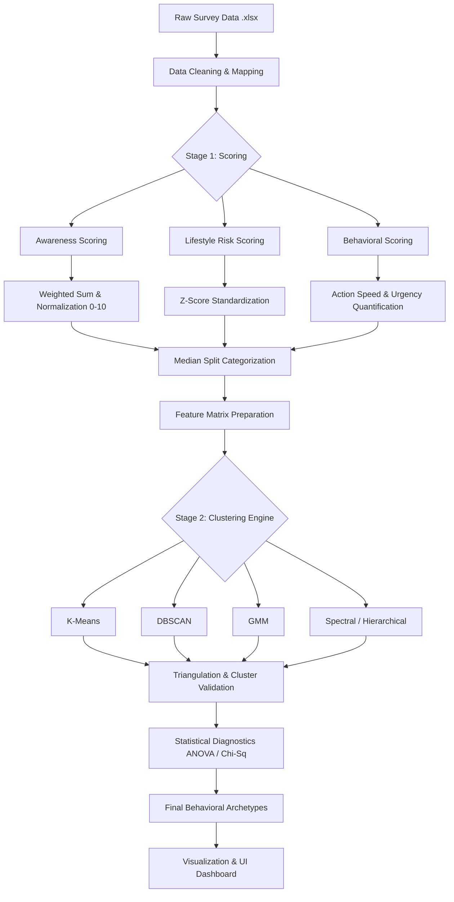
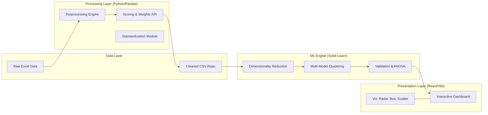

# Stroke Awareness Analysis & Clustering Project

This project focuses on analyzing stroke awareness, lifestyle risks, and demographic factors using a data-driven approach. It involves comprehensive data cleaning, exploratory data analysis (EDA), and advanced population segmentation using multiple clustering algorithms.

## 📁 Project Structure

The project is modularized based on functionality to maintain a clean root directory:

- **`awareness_scoring/`**: Scripts and notebooks for data cleaning and awareness scoring logic.
- **`awareness_visualization/`**: Visual insights, plots, and exploratory analysis notebooks.
- **`core_data/`**: Centralized repository for shared datasets (CSV/Excel) and metadata.
- **`dashboard/`**: React/Vite-based user interface for displaying insights.
- **`docs/`**: Documentation, reports, and technical pipeline details.
- **`models/`**: Major development sub-projects.
  - `clustering_v2/`: Comprehensive population segmentation analysis.
- **`utils/`**: Helper scripts, debug tools, and temporary trials.
- **`current_work/`**: Active working directory for ongoing tasks.

---

## ⚙️ Execution Pipeline & Architecture

The project follows a modular architecture separating data processing, machine learning logic, and the presentation layer.

### 1. System Flowchart
The flowchart below illustrates the end-to-end logic from raw data ingestion to behavioral archetypes.



### 2. Technical Architecture
The system is built to scale, ensuring statistical robustness through algorithm triangulation.



---

## 🚀 Key Features & Workflow

### 🟢 Phase 1: Data Preprocessing & Cleaning
*   **Missing Values**: Handled using median imputation for numerical data and mode for categorical data.
*   **BMI Cleaning**: Extreme outliers from data entry errors are capped to ensure statistical robustness.
*   **Encoding**: Categorical survey responses (Yes/No, Immediate/Delayed) are mapped to structured numeric integers.

### 🟡 Phase 2: Feature Engineering (Composite Scoring)
*   **Awareness Scoring**: Calculates a normalized 0-10 score based on knowledge of specialists, symptoms, and risk factors using a weighted matrix.
*   **Lifestyle Risk Score**: Combines Smoking, Alcohol, Inactivity, and BMI. Each is z-score standardized and averaged to create a single "Risk" metric.
*   **Categorization**: Uses a **Median Split** approach to transform continuous scores into balanced "High/Low" groups for diagnostic analysis.

### 🔵 Phase 3: The Clustering Engine
*   **Dimensionality Reduction (PCA)**: Compresses multi-dimensional behavioral data into 2 principal components to enable 2D visual mapping.
*   **Algorithm Triangulation**: Runs 5 models (K-Means, DBSCAN, GMM, Hierarchical, Spectral). The "Stable 4-Cluster" solution is selected only when patterns persist across all models.
*   **Validation**: Uses **ANOVA** to prove statistical significance between clusters across all behavioral variables ($p < 0.001$).

### 🔴 Phase 4: Insights & Visualization
*   **Clustered Archetypes**: Defines groups like "Knowledgeable but Risky" (High Awareness + High Lifestyle Risk).
*   **UI Integration**: Results are exported to a frontend-ready JSON format for display in a React-based dashboard featuring interactive Radar charts.

---

## 🛠️ Installation & Setup

1. **Clone the repository**:
   ```bash
   git clone [repository-url]
   ```
2. **Install dependencies**:
   ```bash
   pip install -r requirements.txt
   ```

## 📊 Project Status

- **Phase 1 (Variable Definition & Preprocessing)**: ✅ **Complete**
- **Phase 2 (Clustering Implementation)**: ✅ **Complete**
- **Phase 3 (Statistical Validation & Diagnostics)**: ✅ **Complete**
- **Phase 4 (Result Triangulation & Comparison)**: ✅ **Complete**
- **Phase 5 (Dashboard & Final Reporting)**: ✅ **Complete**

## 🧪 Technologies Used
- **Python 3.x**
- **Pandas & NumPy**: Data manipulation.
- **Scikit-learn**: Machine learning and clustering algorithms.
- **Matplotlib & Seaborn**: Data visualization.
- **Openpyxl**: Excel file handling.
- **React & Vite**: Interactive Dashboard.
