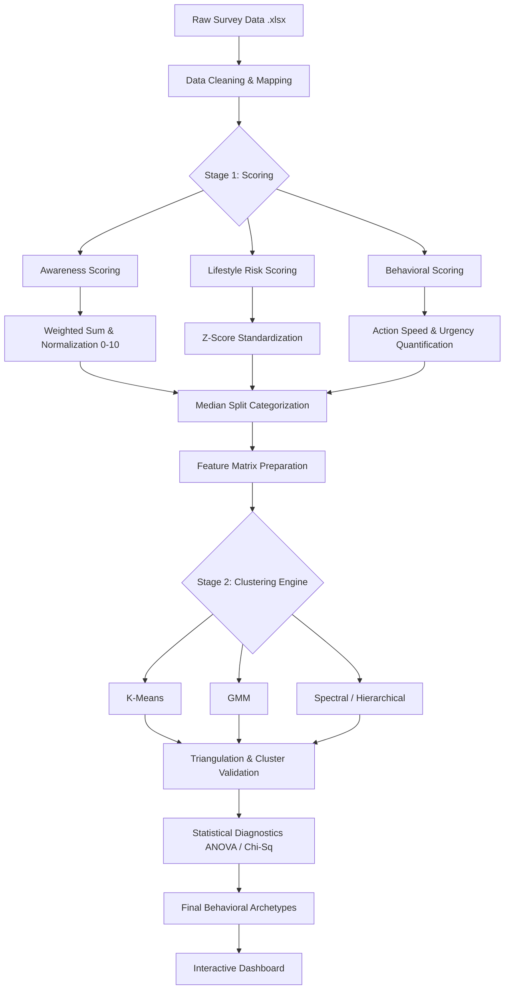

# Stroke Awareness Analysis & Clustering Project

A research-oriented data science project focused on analyzing stroke awareness, lifestyle risks, and emergency response patterns. This system utilizes a multi-model clustering engine to segment populations into actionable behavioral archetypes, providing a scientific foundation for targeted public health interventions.


---

## 📁 Project Structure

The repository is modularized to separate data processing, research analysis, and visual presentation:

-   **`models/clustering_v2/`**: The core research hub. Contains clustering algorithms, statistical validation (ANOVA/Chi-Sq), and the **Cluster Verification Report**.
-   **`dashboard/`**: A React/Vite frontend that visualizes research findings with a fully dynamic, theme-responsive UI.
-   **`awareness_scoring/`**: Logic for normalizing survey data into quantitative 0-10 awareness and risk scores.
-   **`core_data/`**: Centralized repository for raw and cleaned datasets.
-   **`docs/`**: Technical whitepapers, research reports, and pipeline diagrams.

---

## ⚙️ Execution Pipeline & Architecture

The project bridges the gap between raw behavioral data and actionable population insights through a four-stage pipeline.

### 1. System Flowchart


---

## 🚀 Key Research Findings

### 🧠 The Behavioral Archetypes
Through algorithm triangulation, we have identified four stable population segments:

1.  🔴 **Cluster 3: Unaware & Unresponsive (Most Critical)**
    -   *Profile:* Very low awareness (1.60), zero perceived urgency, and minimal action propensity.
2.  🔴 **Cluster 0: At-Risk but Unaware (Hidden Risk)**
    -   *Profile:* Predominantly older individuals with high lifestyle risks who fail to recognize stroke urgency.
3.  🟡 **Cluster 1: Aware but High-Risk (Behavior Gap)**
    -   *Profile:* High knowledge and urgency, but fails to translate awareness into healthy lifestyle choices.
4.  🟢 **Cluster 2: Aware, Healthy & Responsive (Benchmark)**
    -   *Profile:* Mostly younger individuals with high awareness, low-risk habits, and proactive emergency response.

### 📊 Awareness-to-Action Gap
Our analysis quantifies a significant gap where high theoretical knowledge often fails to translate into immediate emergency action (calling ambulance services), highlighting the need for behavioral nudges over traditional information-only campaigns.

---

## 🛠️ Tech Stack & Requirements

### Backend / ML
-   **Python 3.x**
-   **Scikit-learn**: K-Means, GMM, PCA, and ANOVA testing.
-   **Pandas & NumPy**: Data orchestration.
-   **Matplotlib / Seaborn**: Statistical visualization.

### Frontend / Dashboard
-   **React 19 + Vite**
-   **Recharts**: High-fidelity interactive data viz.
-   **CSS Design System**: Semantic tokens for dynamic Light/Dark mode.

---

## 🏁 Getting Started

### 1. Run Data Analysis
To regenerate the behavioral archetypes and dashboard statistics:
```bash
python models/clustering_v2/generate_dashboard_json.py
```

### 2. Launch Dashboard
```bash
cd dashboard/Stroke-awareness-dashboard
npm install
npm run dev
```

---
*Generated by the Stroke Awareness Project Team.*
