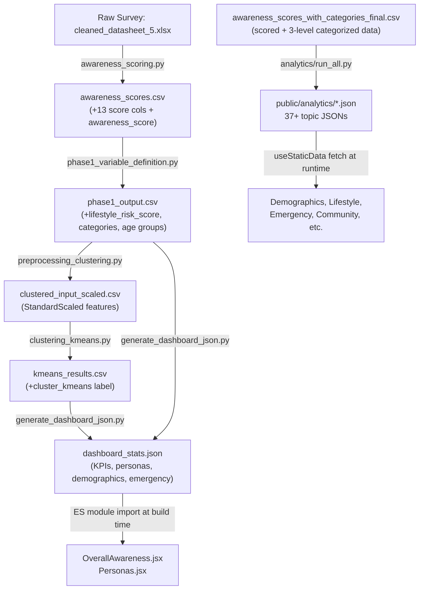

# Data Flow: Raw Survey → Dashboard

This document traces every transformation the data undergoes, from the raw survey spreadsheet to every chart rendered in the React dashboard.

---

## High-Level Pipeline



---

## Stage 1 — Raw Data Input

**File:** `current_work/cleaned_datasheet_5.xlsx`

This is the cleaned survey spreadsheet (~6,168 rows, one row per respondent) with columns for:
- **Demographics:** `age`, `gender`, `educational_level`, `salary`
- **Knowledge questions:** *"Do you know what is a brain stroke?"*, symptom checklists, risk factor checklists
- **Behaviour questions:** *"How soon would you consult a specialist?"*, *"Where to go after stroke symptoms?"*, *"What advice would you give?"*
- **Lifestyle:** `bmi`, smoking, alcohol, physical activity

> [!NOTE]
> Two earlier cleaning notebooks (`data_cleaning1.ipynb` in `awareness_scoring/`, and `data_cleaning2.ipynb` in `current_work/`) precede this. They handle column name normalization, multi-select response flattening, and removal of blank / junk rows. `cleaned_datasheet_5.xlsx` is the final output of that process.

---

## Stage 2 — Awareness Scoring

**Script:** `awareness_scoring/awareness_scoring.py`  
**Input:** `cleaned_datasheet_5.xlsx`  
**Output:** `current_work/awareness_scores.csv`

This script computes **13 atomic sub-scores** by applying hand-crafted scoring functions to specific columns:

| Sub-score column | Survey question scored | Points |
|---|---|---|
| `score_know_stroke` | Know what a stroke is? | 0–1 |
| `score_confusion` | Confusion as symptom? | 0–1 |
| `score_numbness` | Numbness as symptom? | 0–1 |
| `score_vision` | Vision trouble as symptom? | 0–1 |
| `score_nosebleed` | Nosebleed NOT a symptom? (misconception trap) | 0–2 |
| `score_symptoms` | Multi-select symptom checklist (count of correct matches) | 0–6 |
| `score_risk` | Multi-select risk factor checklist (count of correct matches) | 0–10 |
| `score_specialist` | Specialist choice (neurologist → 4, physician → 2, doctor → 1) | 0–4 |
| `score_action_first_symptom` | How soon to consult (immediately → 2, within a day → 1) | 0–2 |
| `score_first_contact` | First contact after symptom (emergency dept → 4, hospital → 3) | 0–4 |
| `score_urgency` | How soon treatment should be taken | 0–2 |
| `score_location` | Where to go (emergency → 4, hospital → 3) | 0–4 |
| `score_advice` | Advice to others (hospital/emergency → 3, doctor → 1) | 0–3 |

**Weighted aggregation:**

```
total_raw_score = Σ (sub_score × weight)
awareness_score = (total_raw_score / max_possible_score) × 10   [clipped 0–10]
```

Weights range from 2 (minor indicators) to 5 (critical indicators like `score_know_stroke`, `score_urgency`, `score_location`).

A separate `symptom_awareness_score` (0–10) is also derived from only the symptom-related columns.

The output CSV carries **all original columns + the 13 sub-score columns + `awareness_score` + `symptom_awareness_score`**.

---

## Stage 3 — Variable Definition & Categorization

**Script:** `models/clustering_v2/phase1_variable_definition.py`  
**Input:** `current_work/awareness_scores.csv`  
**Output:** `models/clustering_v2/phase1_output.csv`

This is the **analytical backbone** — it converts continuous scores into categorical features and builds composite risk metrics.

### 3.1 Lifestyle Risk Score

Four lifestyle columns are encoded to numeric (`smoking_enc`, `alcohol_enc`, `inactivity_enc`, `bmi_clean`), Z-score standardized, and averaged into a single `lifestyle_risk_score`. Cronbach's Alpha is computed to validate internal consistency.

### 3.2 Categorical Derivations (Median Split)

| New column | Derived from | Logic |
|---|---|---|
| `awareness_cat` | `awareness_score` | ≤ median → Low Awareness; > median → High Awareness |
| `lifestyle_risk_cat` | `lifestyle_risk_score` | ≤ median → Low Risk; > median → High Risk |
| `symptom_awareness_cat` | `symptom_awareness_score` | ≤ median → Low; > median → High |
| `action_cat` | `score_action_first_symptom` | ≥ 2 → Proactive; < 2 → Passive |
| `age_group_4cat` | `age` raw label | Maps to: 18–25, 26–40, 41–60, 60+ |
| `age_enc_v2` | `age_group_4cat` | Ordinal 1–4 |

> [!IMPORTANT]
> `awareness_cat` here is a **binary** Low/High split used as a validation variable. The three-level category (Low/Moderate/High) used in most dashboard charts comes from the separate `awareness_scores_with_categories_final.csv` pipeline (Stage 5, Pipeline B).

---

## Stage 4 — Clustering

**Scripts:** `preprocessing_clustering.py` → `clustering_kmeans.py`  
**Input:** `phase1_output.csv`  
**Output:** `kmeans_results.csv`

### Preprocessing

6 features are selected and StandardScaled:
- `awareness_score`, `lifestyle_risk_score`, `score_urgency`, `age_enc_v2`, `score_action_first_symptom`

→ Saved as `clustered_input_scaled.csv`

### K-Means Clustering

K-Means with k=4 is applied (chosen after elbow analysis, silhouette scores, and comparison against DBSCAN, GMM, Hierarchical, and Spectral clustering). Each row gets a `cluster_kmeans` label (0–3).

`kmeans_results.csv` = scaled feature columns + `cluster_kmeans` label per respondent.

---

## Stage 5 — Dashboard JSON Generation (Two Parallel Pipelines)

At this point the data splits into **two independent pipelines**.

### Pipeline A — Clustering-Derived Stats

**Script:** `models/clustering_v2/generate_dashboard_json.py`  
**Inputs:** `kmeans_results.csv` + `phase1_output.csv` (column-merged)  
**Primary output:** `models/clustering_v2/phase5_outputs/dashboard_stats.json`  
**Also overwrites:** `public/analytics/home-analytics.json`, `overall-awareness.json`, `perception-reality.json`, `symptom-trap.json`

This produces a single rich JSON:

```json
{
  "kpi": { "totalRespondents": ..., "avgAwarenessScore": ..., "lowCount": ..., "lowPercent": ... },
  "overall_awareness": [ {"label": "Low Awareness", "count": ..., "percentage": ...}, ... ],
  "perception_reality": { "total_participants": ..., "distribution": [...] },
  "action_gap_percent": 42.5,
  "num_clusters": 4,
  "personas": [ {"id": "cluster-0", "title": "...", "severity": "red", "profile": "..."}, ... ],
  "demographics": { "age": [...], "gender": [...], "educational_level": [...], "salary": [...] },
  "emergency": { "wrong_action_percent": ..., "funnel": [...] },
  "mastery": { "nosebleed_yes_percentage": ..., "all_four_percentage": ..., ... }
}
```

The **4 cluster personas** have hardcoded archetype descriptions:
- Cluster 0: The Hidden Risk Group (🔴 red)
- Cluster 1: The Behavior Gap Group (🟡 amber)
- Cluster 2: The Ideal Group (🟢 green)
- Cluster 3: The Most Critical Group (🔴 red)

### Pipeline B — Topic Analytics JSONs

**Script:** `dashboard/Stroke-awareness-dashboard/analytics/run_all.py`  
**Input:** `analytics/data/awareness_scores_with_categories_final.csv`  
**Output:** 37+ JSON files → `public/analytics/`

This CSV has a **3-level `awareness_category`** (Low / Moderate / High) and is the source for all cross-tabulated breakdowns.

`run_all.py` calls 8 page-level generator modules:

| Module | Key JSON files produced | Dashboard pages served |
|---|---|---|
| `overview.py` | `home-analytics.json`, `overall-awareness.json`, `awareness-score-distribution.json`, `know-stroke.json`, `perception-reality.json` | Landing, Overview |
| `demographics.py` | `age-awareness.json`, `gender-awareness.json`, `education-awareness.json`, `income-awareness.json`, `bmi-awareness.json` | Demographics |
| `lifestyle.py` | `smoking-awareness.json`, `alcohol_consumption-awareness.json`, `regular_physical_activity-awareness.json` | Lifestyle |
| `symptoms.py` | `symptom-identification.json`, `symptom-recall-depth.json`, `tia-awareness.json`, `risk-identification.json` | KnowledgeGap |
| `risk_factors.py` | `risk-gap.json`, `awareness-vs-risk.json` | KnowledgeGap |
| `community.py` | `awareness-sources.json`, `awareness-sources-stacked.json`, `family-history-awareness.json` | Community |
| `insights.py` | `awareness-vs-bmi.json` | Insights |
| `emergency.py` | `first-action.json`, `time-to-treatment.json`, `specialist-consultation.json`, `advice-given.json`, `where-to-go.json`, `action-funnel.json` | Emergency |

Each module calls `utils.save_json()` to write files, and `utils.stacked_by()` to cross-tab any column against `awareness_category` (i.e., produce stacked bar chart data broken down by Low/Moderate/High).

---

## Stage 6 — React Dashboard Consumption

**Framework:** React + Vite + React Router  
**Entry:** `src/main.jsx` → `src/App.jsx` → 7 page routes

### Two distinct data-loading patterns

#### Pattern A — Static ES Module Import (build-time)

Pages `OverallAwareness.jsx` and `Personas.jsx` import `dashboard_stats.json` **directly as a JS module**:

```js
import dashboardData from '../../../../models/clustering_v2/phase5_outputs/dashboard_stats.json';

const kpiData = dashboardData.kpi;
const analyticsData = dashboardData.overall_awareness;
const personas = dashboardData.personas;
```

Vite bundles this JSON into the production bundle at build time — no network request at runtime.

#### Pattern B — Runtime Fetch via `useStaticData` Hook

All other pages use the `useStaticData(jsonPath)` hook defined in `src/data/useStaticData.js`:

```js
export function useStaticData(jsonPath) {
  const [data, setData] = useState(null);
  useEffect(() => {
    fetch(jsonPath)
      .then(res => res.json())
      .then(setData);
  }, [jsonPath]);
  return { data, loading, error };
}

// Usage:
const { data } = useStaticData('/analytics/gender-awareness.json');
```

Files in `public/` are served as static HTTP assets by Vite — fetched at runtime when the component mounts.

### Page → Data Mapping

| Page | Route | Data source & pattern |
|---|---|---|
| **Landing** | `/` | `home-analytics.json` — fetch |
| **Overall Awareness** | `/overview` | `dashboard_stats.json` — import |
| **Demographics** | `/demographics` | `age-awareness.json`, `gender-awareness.json`, `education-awareness.json`, `income-awareness.json` — fetch |
| **Lifestyle** | `/lifestyle` | `smoking-awareness.json`, `alcohol_consumption-awareness.json`, `regular_physical_activity-awareness.json` — fetch |
| **Knowledge Gap** | `/knowledge-gap` | `symptom-identification.json`, `risk-identification.json`, `symptom-trap.json`, etc. — fetch |
| **Emergency** | `/emergency` | `first-action.json`, `time-to-treatment.json`, `action-funnel.json`, `where-to-go.json`, etc. — fetch |
| **Community** | `/community` | `awareness-sources.json`, `family-history-awareness.json`, etc. — fetch |
| **Personas** | `/personas` | `dashboard_stats.json` → `.personas` array — import |

---

## Complete File Lineage

```
current_work/cleaned_datasheet_5.xlsx
    │
    └─[awareness_scoring.py]──────────────→ current_work/awareness_scores.csv
                                                │
                                                └─[phase1_variable_definition.py]──→ models/clustering_v2/phase1_output.csv
                                                                                           │
                                              ┌────────────────────────────────────────────┤
                                              │                                            │
                               [preprocessing_clustering.py]            [generate_dashboard_json.py]
                                              │                                     ↑
                               [clustering_kmeans.py]                  kmeans_results.csv (merged with phase1_output)
                                              │                                     │
                               models/clustering_v2/kmeans_results.csv             │
                                                                           phase5_outputs/dashboard_stats.json
                                                                                     │
                                                                 ┌───────────────────┴──────────────────────────┐
                                                                 │                                              │
                                                   src/pages/OverallAwareness.jsx              public/analytics/ (4 files overwritten)
                                                   src/pages/Personas.jsx
                                                   (ES module import — build time)

analytics/data/awareness_scores_with_categories_final.csv
    │
    └─[analytics/run_all.py]──→ public/analytics/*.json  (37+ topic files)
                                          │
                                          └─[useStaticData() hook — runtime fetch]──→ Demographics, Lifestyle,
                                                                                       Emergency, Community,
                                                                                       KnowledgeGap pages
```

---

## Key Observations

> [!TIP]
> **Two `awareness_category` definitions coexist.** The clustering pipeline produces a binary Low/High split (used in `phase1_output.csv` and `kmeans_results.csv`). The dashboard analytics pipeline uses a 3-level Low/Moderate/High categorization from `awareness_scores_with_categories_final.csv`. Both trace back to `awareness_score` but are binned differently.

> [!WARNING]
> **`generate_dashboard_json.py` partially overwrites `public/analytics/`** — specifically `home-analytics.json`, `overall-awareness.json`, `perception-reality.json`, and `symptom-trap.json`. If you need to refresh all analytics, always run `run_all.py` first, then `generate_dashboard_json.py`, so the cluster-derived numbers win for those 4 files.

> [!NOTE]
> The **Personas page** has zero dynamic data loading. The archetype names, severity colors, and profile descriptions are hardcoded strings inside `generate_dashboard_json.py` and end up statically bundled into the React app at build time.
