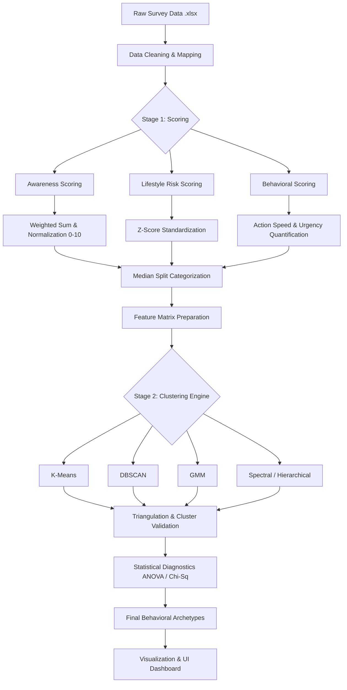
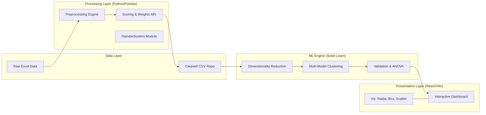

# Stroke Awareness Analysis Pipeline: Technical Details

This document provides a deep dive into the technical architecture and data processing pipeline of the Stroke Awareness project. It is designed to serve as a blueprint for the Proposed System Flowchart and Architecture Diagram.

---

## 1. Proposed System Flowchart
The flowchart below illustrates the step-by-step logic from raw data ingestion to final insights.

---

## 2. System Architecture Diagram
The architecture is modular, separating data processing, machine learning logic, and the presentation layer.

---

## 3. Pipeline Step Descriptions

### 🟢 Phase 1: Data Preprocessing & Cleaning
*   **Missing Values**: Handled using median imputation for numerical data and mode for categorical data.
*   **BMI Cleaning**: Extreme outliers (e.g., >80) from data entry errors are capped to ensure statistical robustness.
*   **Encoding**: Categorical survey responses (Yes/No, Immediate/Delayed) are mapped to structured numeric integers.

### 🟡 Phase 2: Feature Engineering (Composite Scoring)
*   **Awareness Scoring**: Calculates a normalized 0-10 score based on knowledge of specialists, symptoms, and risk factors using a weighted matrix.
*   **Lifestyle Risk Score**: Combines Smoking, Alcohol, Inactivity, and BMI. Each is z-score standardized and averaged to create a single "Risk" metric.
*   **Categorization**: Uses a **Median Split** approach to transform continuous scores into balanced "High/Low" groups for diagnostic analysis.

### 🔵 Phase 3: The Clustering Engine
*   **Dimensionality Reduction (PCA)**: Compresses multi-dimensional behavioral data into 2 principal components to enable 2D visual mapping.
*   **Algorithm Triangulation**: Runs 5 models (K-Means, DBSCAN, GMM, Hierarchical, Spectral). The "Stable 4-Cluster" solution is selected only when patterns persist across all models.
*   **Validation**: Uses **ANOVA** to prove statistical significance between clusters across all behavioral variables ($p < 0.001$).

### 🔴 Phase 4: Insights & Visualization
*   **Clustered Archetypes**: Defines groups like "Knowledgeable but Risky" (High Awareness + High Lifestyle Risk).
*   **UI Integration**: Results are exported to a frontend-ready JSON/CSV format for display in a React-based dashboard featuring interactive Radar charts.
